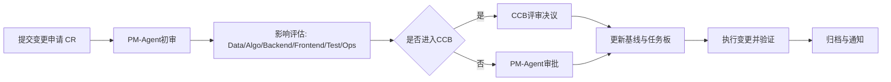

# G1-2 需求基线与变更流程（v1.0）

## 1. 文档信息
- 文档编号：`G1-2`
- 文档版本：`v1.0`
- 生效日期：`2026-03-26`
- 责任 Agent：`PM-Agent`

## 2. 需求基线定义

### 2.1 基线文档清单

| 基线ID | 文档 | 版本 | 冻结日期 | 负责人 |
|---|---|---|---|---|
| BL-REQ-001 | 需求报告 | v1.0 | 2026-03-26 | PM-Agent |
| BL-DES-001 | 系统设计说明书 | v1.0 | 2026-03-26 | PM-Agent |
| BL-IMP-001 | 多 Agent 实现方案 | v1.0 | 2026-03-26 | PM-Agent |
| BL-WBS-001 | 总清单与 Agent 边界 | v1.0 | 2026-03-26 | PM-Agent |
| BL-EXE-001 | 分阶段执行计划 | v1.0 | 2026-03-26 | PM-Agent |
| BL-QA-001 | 阶段检验与测试门禁 | v1.0 | 2026-03-26 | Test-Agent |

### 2.2 基线范围
- 业务目标与范围定义
- 功能需求与非功能指标
- 里程碑计划与任务边界
- 阶段测试门禁与验收标准

## 3. 变更分类

| 类型 | 定义 | 典型示例 | 审批级别 |
|---|---|---|---|
| P0 紧急变更 | 影响里程碑或上线安全 | 推迟 M2、关键安全修复 | CCB + 项目负责人 |
| P1 重要变更 | 影响核心功能或接口契约 | 新增核心 API 字段 | CCB |
| P2 一般变更 | 不影响关键路径 | 文案/报表字段补充 | PM-Agent |
| P3 文档变更 | 不影响代码与流程 | 格式修订、说明补充 | Doc-Agent + PM-Agent |

## 4. 变更控制流程



## 5. 时效 SLA

| 级别 | 受理时限 | 评审时限 | 执行前置 |
|---|---|---|---|
| P0 | 4 小时内 | 24 小时内 | 必须有回滚方案 |
| P1 | 1 工作日内 | 2 工作日内 | 必须完成影响评估 |
| P2 | 2 工作日内 | 3 工作日内 | 仅需 PM-Agent 批准 |
| P3 | 2 工作日内 | 5 工作日内 | 文档留痕即可 |

## 6. 影响评估清单（必填）
- 是否影响里程碑日期
- 是否影响接口契约/数据库结构
- 是否影响测试门禁
- 是否影响生产发布窗口
- 是否需要新增资源（算力/存储/人力）

## 7. CR 模板

```text
CR编号:
提交日期:
提交人/Agent:
变更级别(P0/P1/P2/P3):
变更描述:
影响模块:
影响评估:
回滚方案:
期望生效日期:
审批结论:
```

## 8. 审批与归档
- 审批记录统一归档到 `execution/m1/M1_评审记录_2026-03-26.md`。
- 批准后必须同步更新：
  - `execution/03_M1启动批次任务板.csv`
  - `jira_import_tasks.csv`（状态/优先级/截止日期）
  - `execution/logs/releaselog.csv`（若涉及发布）

